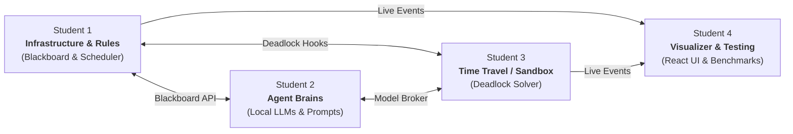

# Project Overview: Intelligible Blackboard Architecture with Counterfactual Agents

Welcome to the **Blackboard Agents** project! This guide explains what this project is all about, why it matters, how the system works, and what each student on the 4-person team will be doing in plain, simple terms.

---

## 1. The Big Picture: What is this Project?

### The Problem with Today's Multi-Agent AI
Most multi-agent AI systems work like a game of **Telephone**:
- Agent A writes a message $\rightarrow$ passes it to Agent B $\rightarrow$ Agent B passes it to Agent C.
- Over long, complex problems, instructions get lost, context degrades, and if one agent makes a mistake, the whole chain falls apart.

```
Linear Chain (Brittle):
[Agent A] ---> [Agent B] ---> [Agent C] ---> (Errors accumulate!)
```

### The Solution: The Blackboard Architecture
Instead of passing private messages down a line, imagine a team of experts standing in front of a **shared digital whiteboard (the Blackboard)** in a conference room:
- Everyone can see the current state of the problem at all times.
- Agents don't talk directly to each other; they post hypotheses, evidence, and critiques directly on the board.
- An intelligent referee (the Scheduler) decides who speaks next.

```
Blackboard Architecture (Transparent & Shared):
            +------------------------+
            |    GLOBAL BLACKBOARD   |
            | (Central Shared State) |
            +------------------------+
              ^         ^         ^
              |         |         |
          [Agent 1]  [Agent 2]  [Agent 3]
```

---

## 2. The Two "Secret Sauces" of this Project

This isn't just a standard blackboard. It introduces two major ideas from modern AI research:

### 1. The PXP Protocol ("Explain Yourself!")
Agents cannot just post random text. Every time an agent writes to the board, it must provide:
1. **Prediction ("What")**: The conclusion or answer.
2. **Explanation ("Why")**: The reasoning and evidence behind it.
3. **PXP Tag**: A clear label describing what it is doing:
   - `RATIFY`: *"I agree with this conclusion and its explanation."*
   - `REVISE`: *"I partially agree, but here is an updated/improved version."*
   - `REFUTE`: *"I disagree with this, and here is why, but I don't have a replacement yet."*
   - `REJECT`: *"I completely reject this conclusion."*

This allows the system to measure **Intelligibility**: Are agents actually reading and understanding each other's explanations, or are they just agreeing blindly?

### 2. Counterfactual Reasoning ("What If?")
Sometimes agents get stuck in an endless argument (a **deadlock**), where they just keep throwing `REFUTE` and `REJECT` at each other.
- **Normal systems**: Crash, run out of memory, or loop forever.
- **Our system**: A specialized agent has a "hindsight superpower." It copies the conversation history, steps into a private simulation sandbox, and asks:
  > *"What if I had given a different explanation or suggested an alternative hypothesis 3 steps ago? Would the group have reached agreement instead of arguing?"*
- Once it finds the winning "what-if" scenario, it steps back onto the live board and posts a smart `REVISE` proposal that breaks the deadlock!

---

## 3. The Scientific Mission (What We Are Proving)

We want to run an **Ablation Experiment** to answer one core research question:
> **"Does giving agents the ability to do counterfactual 'what-if' reflection actually make teams of AI smarter, faster, and less prone to getting stuck?"**

To prove this, we test 4 team setups across standard benchmark datasets:
1. **Control Group**: 0% Counterfactual agents (all standard agents).
2. **Team A**: 33% Counterfactual agents.
3. **Team B**: 66% Counterfactual agents.
4. **Team C**: 100% Counterfactual agents.

We measure:
- **Accuracy & Convergence**: Did they agree on the correct answer?
- **Deadlock Recovery Rate**: How many times did the "what-if" agent rescue the team from a deadlock?
- **Efficiency / Token Cost**: Does thinking back in a sandbox save tokens compared to endless arguing on the board?

---

## 4. Who Does What? (The 4 Student Roles Explained Simply)

Here is how the work is divided across the 4 teammates so that everyone has an exciting, well-defined piece of the puzzle and nobody gets overwhelmed.



---

### Student 1: Infrastructure & Protocol Controller
**Nickname: "The Architect & Referee"**

#### What is their job in simple terms?
Student 1 builds the digital whiteboard itself and enforces the game rules. They make sure multiple agents can read and write without crashing or corrupting data. They also build the "referee" (Scheduler) that monitors the board and decides whose turn it is.

#### What will their day-to-day code look like?
- Writing clean Python data classes (using Pydantic) that define what a blackboard entry looks like.
- Building the thread-safe blackboard storage (in-memory or Redis).
- Writing the PXP validator: checking that agents only use `RATIFY`, `REVISE`, `REFUTE`, and `REJECT` legally.
- Creating the scheduler loop: detecting when the team has reached agreement or when they are stuck in a deadlock.
- Later in the project: Writing data loaders for two of the datasets (KramaBench and MedAgentBench).

#### Key Deliverables:
- `blackboard/` (the shared state store)
- `contracts/` (the shared schemas everyone else imports)
- `protocol/` (PXP grammar validator)
- `scheduler/` (the turn-taking loop)

---

### Student 2: Agent Engineering & Model Inference Pipeline
**Nickname: "The Agent Brain Trainer"**

#### What is their job in simple terms?
Student 2 is responsible for the AI agents themselves. They set up local AI models (like Qwen2.5-7B or Llama-3.1-8B using Ollama or LiteLLM) to run on standard computers. They write the prompt instructions that teach these models how to behave like specific experts (doctors, engineers, analysts) and how to respond strictly using predictions and explanations.

#### What will their day-to-day code look like?
- Setting up the local LLM runner (Ollama / LiteLLM) and making sure it doesn't crash the computer's memory when queried.
- Engineering system prompts so models reliably output clean JSON with predictions, explanations, and PXP tags.
- Creating different agent "personas" (e.g., an aggressive skeptical reviewer vs. a collaborative synthesizer).
- Building a mock agent mode so other teammates can test their code immediately without waiting for slow local AI inference.

#### Key Deliverables:
- `llm_broker/` (the model calling engine and memory manager)
- `agents/` (base `PEXAgent` class and persona matrix)
- `prompts/` (the structured prompt templates)

---

### Student 3: Counterfactual Sandbox & Deadlock Architect
**Nickname: "The Time Traveler & Problem Solver"**

#### What is their job in simple terms?
Student 3 builds the "hindsight engine." When the team gets stuck in a loop of arguing (`REFUTE`/`REJECT`), Student 1's scheduler sends an alert. Student 3's code catches this alert, clones the conversation history into a private sandbox, and runs "what-if" simulations to see which past statement caused the problem. Once the best alternative is found, Student 3 packages it as a fresh `REVISE` suggestion and injects it back to the group.

#### What will their day-to-day code look like?
- Prototyping the "what-if" algorithm in a Jupyter notebook first during Week 1.
- Writing a sandbox manager that can instantly deep-copy the blackboard state without affecting the live run.
- Creating the root-cause finder: looking back at recent turns to find where the disagreement started.
- Simulating 1 or 2 alternative steps forward in the sandbox using Student 2's model broker.
- Scoring which branch is best and handing it back to Student 1's blackboard.

#### Key Deliverables:
- `sandbox/` (the isolated clone environment)
- `counterfactual/` (the root-cause attribution and branching logic)
- `deadlock_solver/` (the bridge that detects deadlocks and injects solutions)

---

### Student 4: Real-Time Visualization UI & Benchmarking Lead
**Nickname: "The UI Artist & Experiment Director"**

#### What is their job in simple terms?
Student 4 has two very fun, impactful responsibilities:
1. **The Live UI**: Building a modern web dashboard (React + React Flow) where anyone can watch the blackboard live—seeing nodes connect as agents talk, watching red alerts flash during deadlocks, and opening a split-screen view to watch the counterfactual "alternative timeline" branch out!
2. **The Experiments**: Writing the batch test runner that loads problems from benchmark datasets, runs them through the multi-agent system, counts tokens and accuracy, and produces the graphs and charts for the research paper.

#### What will their day-to-day code look like?
- Building a FastAPI WebSocket server that broadcasts blackboard updates to the browser.
- Writing the React / Vite frontend with interactive node graphs (using React Flow or D3).
- Building the split-screen view showing the live debate on the left and the sandbox branch on the right.
- Writing the MSCoRe dataset loader and the shared automated batch runner.
- Generating the final publication-ready charts (e.g. accuracy vs. counterfactual density).

#### Key Deliverables:
- `frontend/` (interactive web dashboard)
- `streaming/` (WebSocket backend server)
- `benchmarks/` (MSCoRe ingestor and batch trial runner)
- `analytics/` (token calculators and chart plotting scripts)

---

## 5. How the Pieces Fit Together (Step-by-Step Scenario)

To see how all 4 students' work connects, follow a single problem run:

1. **Student 4's runner** feeds a complex medical or engineering question to the system.
2. **Student 1's Scheduler** initializes the problem on the **Blackboard**.
3. **Student 2's Agents** wake up. Agent A posts a hypothesis with a prediction and explanation (`PROPOSE`).
4. Agent B reviews it, disagrees, and posts `REFUTE`. Agent A responds with `REJECT`. They are now in a deadlock loop!
5. **Student 1's Scheduler** detects the loop: *"Deadlock alert!"*
6. **Student 3's Counterfactual Solver** steps in:
   - Clones the blackboard state into a private sandbox.
   - Tests: *"What if Agent A had offered an alternative synthesis at Step 2?"*
   - Replays 1 turn in the sandbox; it leads to consensus!
   - Hands a new `REVISE` entry to the live blackboard.
7. **Student 4's Web Dashboard** displays the entire sequence live:
   - Green nodes for agreement, red flashes for the deadlock.
   - A split-screen opens up showing the "what-if" branch in purple/blue.
   - The deadlock clears, and consensus is reached.
8. **Student 4's Analytics** records whether the final answer was correct, how many tokens were used, and logs the successful deadlock recovery.

---

## 6. Project Timeline at a Glance

| Weeks | Phase | Goal |
|---|---|---|
| **Week 1** | **Setup & Contracts** | Everyone sets up their environment. Student 1 publishes the data models so nobody is blocked. Student 3 prototypes the what-if algorithm in a notebook. |
| **Weeks 2–3** | **Milestone 1** | Central blackboard works; a single agent can read and post; basic UI shell is up. |
| **Weeks 4–5** | **Milestone 2** | Full multi-agent debates with local models; PXP tags enforced; live WebSocket streaming to UI. |
| **Weeks 6–7** | **Milestone 3** | Counterfactual sandbox works; synthetic deadlocks are automatically resolved; split-screen UI shows alternative timelines. |
| **Week 8** | **Integration** | All four parts hooked together; end-to-end test on sample problems. |
| **Week 9** | **Milestone 4a (Testing)** | Automated evaluation runs across benchmarks (0%, 33%, 66%, 100% counterfactuals). |
| **Week 10** | **Milestone 4b (Wrap-Up)** | Generate charts, analyze results, and write the final research paper! |

---

## 7. Golden Rules for Team Success

1. **Contracts First**: Student 1 publishes mock data structures in Week 1. This means Student 2, 3, and 4 can build and test their code on Day 2 without waiting for the full backend to be finished.
2. **Use Mock Mode Early**: Don't wait for slow 7B LLM inference to test UI or scheduler code. Use fast mock agents first, then turn on real AI models once the pipes work.
3. **Keep Counterfactuals Bounded**: In the sandbox, test 1-hop or 2-hop variations rather than exploring endless infinite branches.
4. **Scale Tests Smartly**: Debug on 5–10 problems first. Once everything is stable, run the full batches for the paper.
